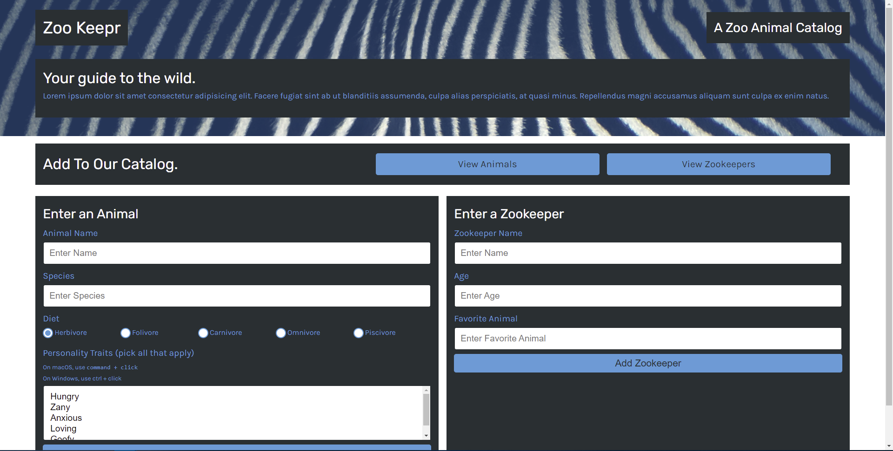

# Zoo Keepr
## Description
A server based application to manager and see Zoo animals and Zookeeper data via a stylish UI. 

## Table of Contents
* [Usage](#usage)
* [Questions](#questions)

      
* [Installation](#installation)
        
* [Credits](#credits)
        
* [License](#license)
        
* [Contributing](#contributing)
        
* [Tests](#tests)
        
    
  

## Installation
There is no need to install this application to use it. Visit the [Usage](#usage) section for a link to the server deployed application.    To create your own version, clone this repository locally and run `nmp i` to install the required dependencies. See the [Credits](#credits) section for information on these dependencies and how to use them. 
    
## Usage
This application allows you to see and manage the animals and Zookeepers of the server.    Visit the site and click on *View Animals* to see the current catalog of animals.   Click on *View Zookeepers* to see the current catalog of Zookeepers.   From the main page you have two forms: one to add a new animal and one to add a new Zookeeper. Fill out the required information and click the **ADD** button to add to the respective catalog.    *Future Update: allow the user to click on a **REMOVE** button on the animal or Zookeeper in the catalog to remove them.

### Screenshot

    

### Link
https://sir-ubu-zookeepr.herokuapp.com/
    

## Credits
**RESOURCES**   [Heroku](https://dashboard.heroku.com)   [Jest.js](https://jestjs.io/)   [Express.js](https://expressjs.com/)   [Node.js](https://nodejs.org/en/)
    

## License

    

## Contributing
This repository is not open to outside contribution.

## Tests
This application uses Jest.js for testing framework. Visit [Credits](#credits) for the link.    THere are two testing suites:   1. animals.test.js   2. zookeepers.test.js    Each of these testing suites are designed to test the following:   - Creation of a new object   - Search query from options.   - Search by ID   - Validate the appropriate information for adding to catalog.    To runs these test locally, once cloned and dependencies installed, in the terminal execute `npm test` ro run all tests or `npm run test zookeepers` or `npm run test animals`. 
    
## Questions
For all questions regarding this project, feel free to contact me at:

GitHub: [SirUbu](https://github.com/SirUbu)

Email: thesirubu@gmail.com
